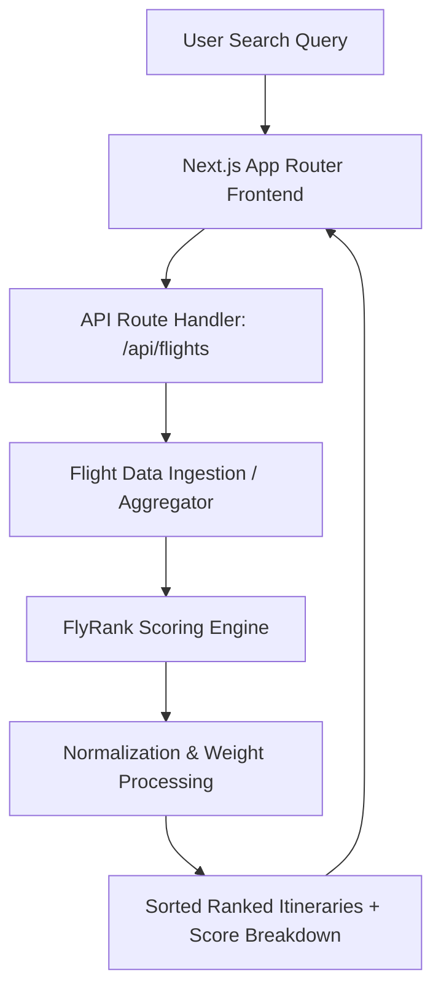

# FlyRank ✈️

[](LICENSE)
[](https://nextjs.org/)
[](https://www.typescriptlang.org/)
[](https://tailwindcss.com/)
[](https://conventionalcommits.org)

> **Intelligent Flight Ranking & Comparison Engine**  
> Moving beyond basic price sorting to compute real traveler utility scores based on price, total travel time, layover friction, airline reliability, and environmental efficiency.

---

## 🌟 Why FlyRank?

Standard flight aggregators optimize primarily for one dimension: price. However, the cheapest ticket often hides costly trade-offs: 14-hour overnight layovers, unfavorable departure times, high baggage fees, or notoriously delayed carriers.

**FlyRank** solves this by evaluating itineraries through a multi-factor utility algorithm, producing a single, normalized **FlyRank Score (0–100)** to help travelers find their true optimal flight.

---

## 🧮 Scoring Algorithm & Methodology

FlyRank uses a weighted Multi-Attribute Utility (MAU) function:

$$\text{FlyRank Score} = \sum_{i=1}^{n} w_i \times S_i$$

### Default Factor Weighting

| Metric | Weight ($w_i$) | Evaluation Logic |
| :--- | :---: | :--- |
| **Price Utility ($S_{\text{price}}$)** | **40%** | Inverse log-scaled price compared against median route baseline |
| **Duration Efficiency ($S_{\text{duration}}$)** | **25%** | Penalty for excess travel duration relative to direct route |
| **Layover Comfort ($S_{\text{layover}}$)** | **15%** | Heavy penalties on layovers $< 60\text{ min}$ (risk) or $> 4\text{ hrs}$ (fatigue) |
| **Carrier Reliability ($S_{\text{carrier}}$)** | **10%** | On-time arrival performance and traveler satisfaction score |
| **Carbon Impact ($S_{\text{eco}}$)** | **10%** | Estimated $\text{CO}_2$ emissions per passenger kilometer (g/pkm) |

*Travelers can dynamically adjust these weights in real-time using the interactive filter sliders.*

---

## 🏗️ System Architecture



---

## 🚀 Key Features

- **Multi-Factor Ranking**: Instant scoring out of 100 with clear breakdowns.
- **Dynamic Weight Adjuster**: Real-time slider recalculation without full page reloads.
- **Layover Stress Index**: Flags tight connection risks and uncomfortable overnight stops.
- **Eco-Efficiency Indicator**: Highlights low-emission aircraft itineraries.
- **Transparent Reasoning**: Every card displays exactly why it was ranked high or low.

---

## 📡 API Reference

### `GET /api/flights`

Search and retrieve ranked flights.

#### Query Parameters
- `origin` (string, required): 3-letter IATA code (e.g. `JFK`)
- `destination` (string, required): 3-letter IATA code (e.g. `LHR`)
- `date` (string, required): ISO departure date (`YYYY-MM-DD`)
- `weight_preset` (string, optional): `balanced` | `budget` | `business` | `eco`

#### Example Response
```json
{
  "searchId": "fr_9a8b7c6d",
  "route": { "origin": "JFK", "destination": "LHR", "date": "2026-10-15" },
  "resultsCount": 42,
  "flights": [
    {
      "flightId": "FL-1029",
      "airline": "British Airways",
      "flightNumber": "BA178",
      "price": 540,
      "currency": "USD",
      "totalDurationMinutes": 420,
      "stops": 0,
      "flyrankScore": 92.4,
      "scoreBreakdown": {
        "priceScore": 88.0,
        "durationScore": 98.0,
        "layoverScore": 100.0,
        "carrierScore": 91.0,
        "ecoScore": 85.0
      }
    }
  ]
}
```

---

## 🛠️ Tech Stack

- **Framework**: [Next.js 15](https://nextjs.org/) (App Router, Server Components)
- **Language**: [TypeScript](https://www.typescriptlang.org/) (Strict typing)
- **Styling**: [Tailwind CSS](https://tailwindcss.com/)
- **Icons**: [Lucide React](https://lucide.dev/)
- **Runtime**: Node.js 20+ LTS
- **Testing**: Vitest & React Testing Library

---

## ⚡ Getting Started

### Prerequisites
- Node.js `v20.0.0` or higher
- npm `v10.0.0` or higher

### Installation

```bash
# 1. Clone repository
git clone https://github.com/Ravitej555/flyrank.git
cd flyrank

# 2. Install dependencies
npm install

# 3. Start local development server
npm run dev
```

Open [http://localhost:3000](http://localhost:3000) in your browser.

---

## 🗺️ Capstone Roadmap

- [x] Phase 1: Repository scaffolding, license, and guidelines (`CLAUDE.md`)
- [ ] Phase 2: Core multi-criteria flight scoring algorithm and unit test suite
- [ ] Phase 3: Interactive Next.js UI with dynamic weight adjustment sliders
- [ ] Phase 4: Mock flight data generator and flight provider API integration
- [ ] Phase 5: Final deployment and performance optimization

---

## 📄 License

Distributed under the [MIT License](LICENSE). See `LICENSE` for more information.