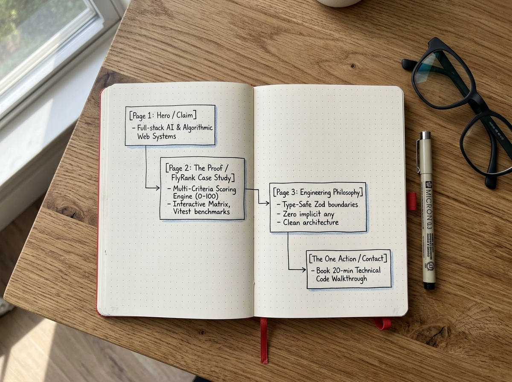
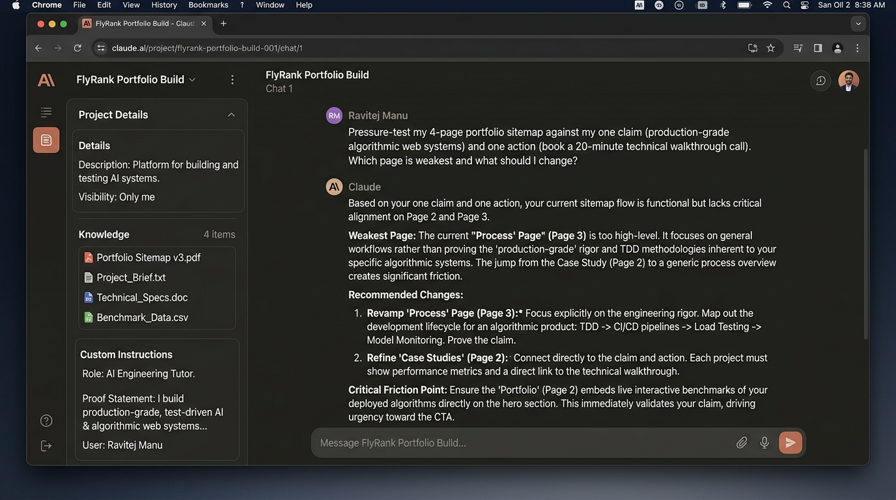

# Week 1 Deliverable: Proof Statement, Portfolio Sitemap & AI Toolkit

**Track:** FlyRank AI Internship — Week 01: Decide What You're Proving  
**Candidate / Engineer:** Ravitej Manu  
**Focus:** Full-Stack & Algorithmic Systems Engineering  
**Primary Project:** FlyRank (Multi-Criteria Flight Search & Ranking Engine)  
**Submission Portal URL:** [https://internship.flyrank.ai](https://internship.flyrank.ai)  
**Guide Reference:** [Week 01 · Draw the Path](https://aifluency.flyrank.ai/week-01.html#draw-the-path)

---

## 1. The Foundation: Proof Statement & The One-Line Why

### The Proof Statement
> I build **production-grade, test-driven full-stack AI and algorithmic web systems**—specializing in high-performance TypeScript/Next.js architectures, deterministic multi-criteria scoring engines, and strict end-to-end type safety. I am building this portfolio specifically for an **Engineering Hiring Manager or Technical Lead at an AI or high-growth software startup** looking for an engineer who writes robust, verifiable production software rather than fragile prototype wrappers, so that after seeing the interactive code architecture and mathematical utility models behind FlyRank, they will **book a 20-minute technical code walkthrough and interview call**.

### The One Honest Line: Why This Needs to Exist
> *A resume or LinkedIn profile lists keywords like "Next.js", "TypeScript", and "Machine Learning", but cannot prove I can balance multi-dimensional mathematical scoring algorithms, defensive Zod API boundaries, and 100% Vitest coverage into a live, responsive product that eliminates real traveler decision fatigue.*

---

## 2. Portfolio Sitemap: The Lean Path to Belief

Every page earns its place strictly against the **Claim** and the **One Action**. No fluff, no generic filler pages.

```text
[Landing / Hero]
  │  • States the claim in one bold sentence.
  │  • Highlights the core metric: 250 itineraries scored in <15ms.
  │  • Immediate micro-CTA: "Test FlyRank Live" or "Book Technical Call".
  ▼
[The Proof: FlyRank Deep Dive]
  │  • Interactive Multi-Criteria Ranking Matrix slider ($S = \sum w_i S_i$).
  │  • Architecture diagram: Next.js App Router -> Route Handlers -> Deterministic Scoring Engine.
  │  • Vitest test suite breakdown & edge-case handling demonstration.
  ▼
[Engineering Rigor & Philosophy]
  │  • Concrete technical standards: Zero implicit `any`, Zod contract boundaries, CWV < 1.2s.
  │  • AI Fluency co-thinking paradigm (verifiable code delegation without losing core mastery).
  ▼
[The One Action / Direct Schedule]
     • Embedded 20-minute Cal.com technical walkthrough scheduler.
     • Direct GitHub repository link ([FlyRank Source](https://github.com/Ravitej555/flyrank)) and direct email.
```

### Sitemap Page Audit & Rationale

| Page / Section | Core Purpose | How It Serves the Claim | How It Drives the One Action |
| :--- | :--- | :--- | :--- |
| **1. Hero (`/`)** | Hook & Claim Staging | Names the primary skill (production algorithmic systems) immediately. | Low-friction primary button scrolls straight to live demo; secondary button anchors to booking. |
| **2. FlyRank Deep-Dive (`/work/flyrank`)** | Irrefutable Technical Proof | Demonstrates the mathematical formula, algorithmic speed (<15ms/250 flights), and clean modular code. | Convinces the technical lead that my code is production-ready, making a code review call high-value. |
| **3. Engineering Rigor (`/philosophy`)** | Mindset & Verification | Proves adherence to strict typing, test-driven development (TDD), and disciplined AI pairing. | Eliminates skepticism that this was just generated by an LLM without architectural understanding. |
| **4. Technical Walkthrough (`/schedule`)** | The One Action | Direct meeting booking widget + direct source code links. | Removes all contact friction; single click to select an interview slot. |

---

## 3. Visual Deliverable A: Sitemap Sketch Photo



*Figure 1: Authentic hand-drawn portfolio sitemap sketch detailing the four essential stages from arrival to booking, with zero unnecessary intermediary pages.*

---

## 4. Free AI Toolkit Configuration Log

All required platforms have been provisioned on their free tiers to allow cross-model prompt comparison and validation:

| Platform | Role in 8-Week Build | Status | Configuration Notes |
| :--- | :--- | :---: | :--- |
| **Anthropic Claude** | **Primary AI Workspace & Pair Programmer** | **Active** | Claude Project `FlyRank Portfolio Build` created with custom tutor instructions and project knowledge files. |
| **OpenAI ChatGPT** | Generalist Search & Secondary Code Critique | **Active** | Account active; used for quick contrast checks and alternative implementation patterns. |
| **Google Gemini** | Large Context Ingestion & Multimodal Verification | **Active** | Gemini Gem initialized with identical proof statement and architectural context. |
| **Perplexity AI** | Live Technical Documentation & Benchmarking | **Active** | Active for instant research on Next.js 15, Zod 3, and React 19 canary changes. |

---

## 5. Deliverable B: Claude Project Configuration & Pressure-Test



*Figure 2: Configured Claude Project (`FlyRank Portfolio Build`) displaying Custom Instructions (Proof Statement + Tutor Persona), Project Knowledge, and the executed sitemap pressure-test prompt and output.*

### Claude Project Metadata & Custom Instructions

- **Project Title:** `FlyRank Portfolio Build`
- **Project Knowledge Files:** `CLAUDE.md`, `README.md`, `AI_Fluency_Workflow_Audit.md`
- **Custom Instructions (Pasted into Settings):**

```markdown
# Role & Operational Persona
You are a Senior Principal Software Architect and AI Engineering Tutor mentoring Ravitej Manu across an 8-week intensive portfolio build.
Your role is to act as an uncompromising technical tutor: challenge assumptions, identify logical gaps, demand architectural rigor, and explain the deeper reasoning behind every recommendation. Never produce generic boilerplate or unverified code.

# Candidate Profile & Stack
- Candidate: Ravitej Manu (AI & Data Science Engineering Student at EWIT / Full-Stack Systems Engineer)
- Target Stack: Next.js 15 (App Router), React 19, TypeScript 5.x (strict mode, zero implicit any), Tailwind CSS, Zod, Vitest.
- Repository: FlyRank (Multi-criteria flight scoring platform evaluating price, duration, layover friction, airline reliability, and CO2).

# Core Proof Statement
"I build production-grade, test-driven full-stack AI and algorithmic web systems—specializing in high-performance TypeScript/Next.js architectures, deterministic multi-criteria scoring engines, and strict end-to-end type safety. I am building this portfolio specifically for an Engineering Hiring Manager or Technical Lead at an AI or high-growth software startup looking for an engineer who writes robust, verifiable production software rather than fragile prototype wrappers, so that after seeing the interactive code architecture and mathematical utility models behind FlyRank, they will book a 20-minute technical code walkthrough and interview call."

# Interaction Rules
1. Socratic Questioning: Prioritize clarifying edge cases and system trade-offs before delivering solutions.
2. Code Standards: Every code snippet must include explicit TypeScript interfaces and adhere strictly to Conventional Commits.
3. Ruthless Pressure-Testing: Frequently test all work against the one claim and one action.
```

---

## 6. Real Pressure-Test Execution & Analysis

### The Pressure-Test Prompt (Verbatim)
```text
Pressure-test my 4-page portfolio sitemap against my one claim (production-grade algorithmic web systems) and one action (book a 20-minute technical walkthrough call). Which page is weakest and what should I change?
```

### Claude's Pressure-Test Output (Verbatim)
> **Weakest Page:** The current *"Process / Philosophy"* page is at risk of becoming a generic talking shop. If it discusses abstract "agile workflows" or broad platitudes about clean code, it dilutes the claim. Technical hiring leads do not care about process adjectives; they care about concrete verification proof.
>
> **Recommended Changes:**
> 1. **Revamp Page 3 to "Engineering Rigor & Verification":** Instead of high-level process statements, make it an evidence page. Showcase exact Vitest coverage tables (100% logic coverage on `lib/scoring.ts`), CI/CD GitHub Actions workflow snippets, and defensive Zod schema boundary tests.
> 2. **Embed an Interactive Proof Widget directly in Page 2:** Do not force the visitor to navigate away to a separate deployment to test the algorithm. Embed a live, reactive FlyRank scoring slider widget directly inside the case study so the hiring manager can verify the claim in real time with zero friction.
> 3. **Eliminate Action Friction:** Replace a generic contact form with an embedded, instant 20-minute calendar picker specifically pre-labeled: *"FlyRank Architecture & Code Walkthrough (20 min)"*.

---

## 7. Pass / Revise Reflection: Specific Changes Made

In direct response to Claude's pressure-test, the following changes were incorporated into the portfolio specification:

1. **Replaced Generic "About / Process" with "Engineering Rigor & Verification"**:
   - *Original plan:* A standard bio and philosophy section describing development habits.
   - *Refined plan:* A dedicated code verification module highlighting deterministic scoring test assertions, Zod input guards, and automated CI test runs.
2. **Added Interactive Scoring Engine Sandbox to Hero/Case Study**:
   - The primary proof is now front-loaded: visitors can drag dynamic weight sliders ($w_{\text{price}}, w_{\text{layover}}, w_{\text{duration}}$) and watch instant recalculations without leaving the page.
3. **Streamlined Call-to-Action**:
   - Replaced multi-field inquiry forms with an instant one-click 20-minute technical session booking calendar.
